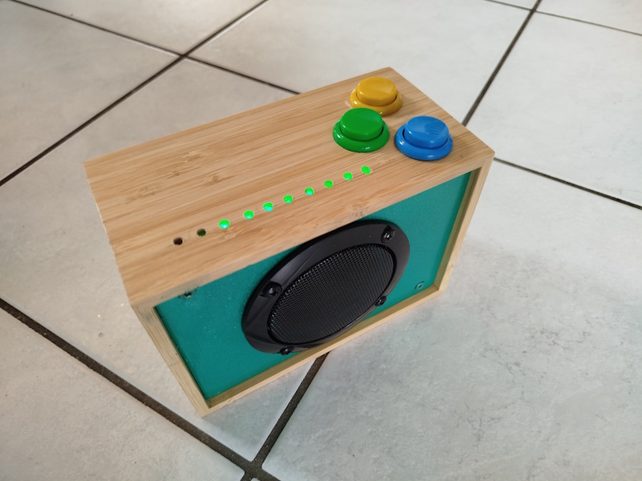
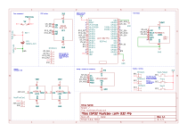
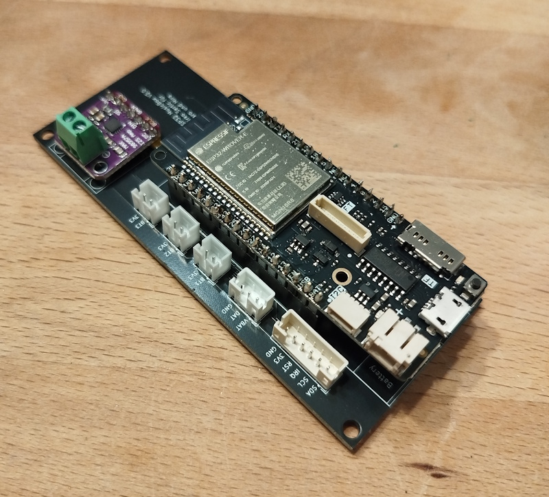

# ESP32 MusicBox

This project provides an ESP32 based music box with the following features:

* Simple 3-button control
* MP3 playback
* Integration with I2C RFID tag scanner
* Support for WiFi Grids with auto-reconnect to nearest access point
* MQTT status reporting / remote control
* Home Assistant integration with device autodiscovery
* Web-based user interface
* Integrated into your local network with SSDP / mDNS protocol
* WebDAV support for file / content management
* Optional Bluetooth A2DP output / Bluetooth Headphone output
* Special mode to start in Bluetooth Speaker mode, so it works as a Boombox.

## Supported hardware

* ESP32 (tested with Lolin D32 Pro with a lot of PSRAM recommended (8 MB), 4MB flash RAM is required)
* PN532 RFID Reader (i2c-Mode)
* SDCard Reader (SPI-Mode), is already mounted on a Lolin D32 Pro board
* NeoPixel / WS2812 based LEDs for status visualization

## Final product

The KiCad 9.0 project is located in the kicad folder.

Here is the wiring schematic drawing:

## Manual

Status visualization with LEDs:

- Boot-Sequence - LEDs enabled step by step to visualize boot progress
- Leds cycling in brightness - orange in case WiFi is not connected but enabled, green in case if playback paused or no playback yet
- Leds green from 0% to 100% filling the circle - Playback progress while playing something
- Leds blinking red - Unknown RFID card detected
- Leds blinking green - RFID card programmed / Known card detected
- Leds green to red - While changing volume
- Keep button 1 pressed during startup. Leds will turn blue to indicate Bluetooth Speaker mode.
- Yellow flashing LEDs indicate a Bluetooth pairing request while in Speaker mode. Press button 1 again to confirm the pairing. LEDs will flash in blue to confirm pairing
